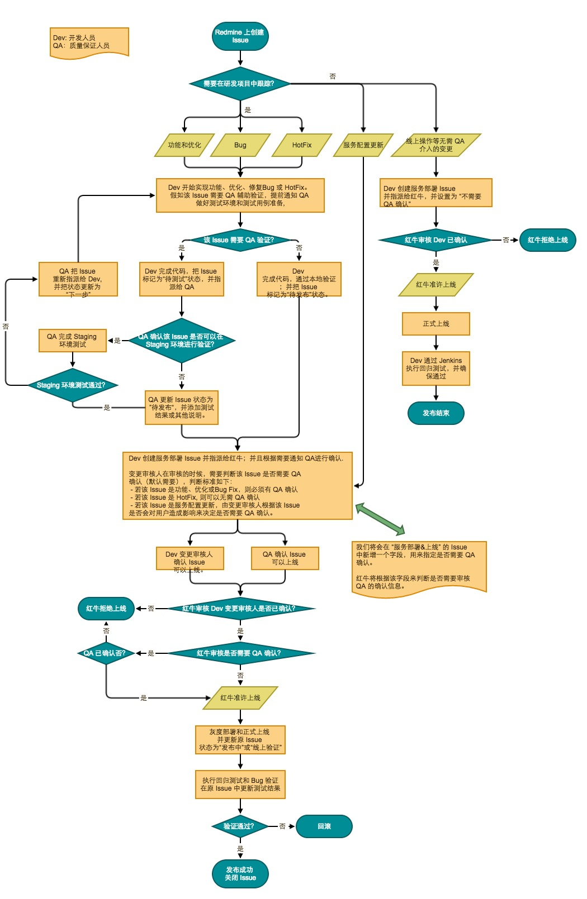
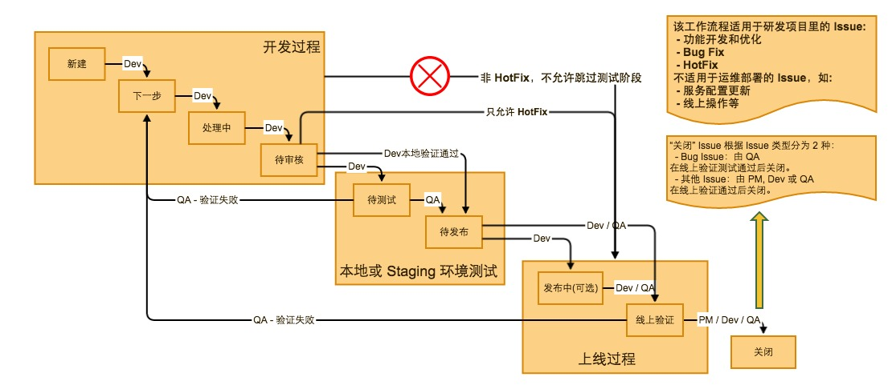
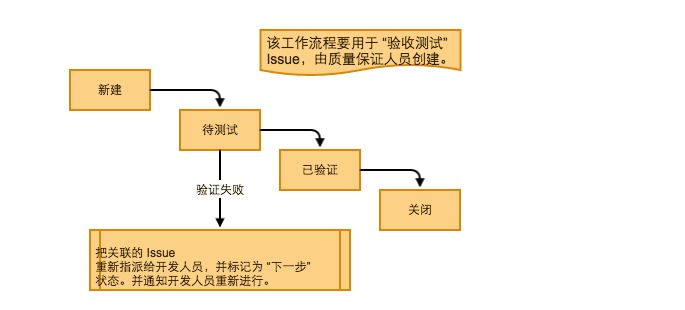

七牛开发规范
=====

# 文档规范

* 对外的可公开给客户的文档，请统一放到 https://github.com/qbox/product 相应产品的目录下。
* 内部架构设计，或者内部服务的API协议文档，请放到模块所在的repo。可以统一放到 repo 根目录 docs 目录下，也可以放在模块本身的 README.md 或 docs 中。但是有一个硬性的要求，就是 repo 的 README.md 需要有这些模块相关文档的链接。

# 代码审察（CodeReview）规范

* 确认文档（特别是API协议文档）与实现代码的一致性。
* 确认单元测试的覆盖率。
* 评估架构设计的缺陷。
* 指出代码实现缺陷，比如条件分支考虑不严谨之类。
* 提出不良代码风格的修改建议。

建议的审察流程：

* 先找同伴进行初审（PeerReview）。
* 再找有merge权限的同事进行FormalReview以进行合并。

# 模块命名

我们当前有如下常见名字空间：

* qbox.us          - 这个是过时的名字空间，新 package 建议以 qiniu.com 取代之。
* qiniu.com        - 业务代码的建议名字空间。
* qiniupkg.com     - 新的七牛开源代码的名字空间。
* github.com/qiniu - 老的七牛开源代码的名字空间。但这个名字空间会保留，作为预备开源的代码存放地。

另外，我们要求所有的模块都需要带上版本号，第一版本通常叫 v1。如果发生了以下事实，需要对版本号进行升级：

* 模块对外的使用规格（接口）发生了不兼容调整。
* 模块进行了大范围重构，新的 package 在稳定性上不能确保和旧 package 在同一个水平。

举例，我要写一个新模块 foo，如果打算开源，那么通常它刚开始的 package 名为 `github.com/qiniu/foo.v1`。如果没有计划开源，则模块名一般是 `qiniu.com/<product>/foo.v1`。比如对存储团队的模块是 `qiniu.com/kodo/foo.v1`。

# 开发、测试和发布流程

在一个产品或服务正式上线后，我们要求任何对线上服务的修改，都必须在 [Redmine](https://pm.qbox.me) 创建 Issue 来进行跟踪，并记录下对该 Issue 的开发、测试及上线的整个过程。

正常情况下，一次变更一般会经历 "开发 -> 测试 -> 线上发布" 几个阶段，整个流程大体包含以下几个步骤：

1. 对于任何准备发布到生产环境的功能、优化、Bug Fix 和 HotFix，研发人员都必须确保在 Redmine 上有对应的 Issue 来进行状态跟踪。

2. 开发人员根据对 Issue 的具体更改进行判断，决定该 Issue 是否需要 QA 参与来进行测试（主要指 QA 预先在 Staging 环境进行集成测试）。假如该 Issue 需要 QA 参与测试，则开发人员应该尽早通知到 QA，以方便 QA 及时准备测试环境和测试用例。原则上，除 HotFix 外，任何对七牛的产品和服务的 API 接口有改动的或者是对用户有明显感知的 Issue，都需要经过 QA 的测试才能上线发布。

3. 当一个 Issue 的代码完成并通过验证后（根据步骤 2 中描述的是否有 QA 参与，可以是开发人员本地验证或者 QA Staging 环境验证），该 Issue 将进入“待发布”状态。此时，开发人员可以更新 Deploy 库并提交 PR。

4. 针对每次上线操作，开发人员需要向运维人员提交新的 服务部署上线的 Issue ，并关联到对应的功能 Issue 或者 Bug Issue。此外，除 HotFix 等特殊情况外，开发人员或变更审核人应通知到相关 QA 对该 Issue 进行签署确认。原则上：
    - 若原 Issue 是功能、优化或Bug Fix，则必须有 QA 签署确认
    - 若原 Issue 是 HotFix, 则可以无需 QA 确认
    - 若原 Issue 是服务配置更新，由变更审核人根据该 Issue 是否会对用户行为造成影响来决定是否需要 QA 签署确认。

5. 运维人员对于服务部署上线的 Issue 进行审核时，除了检查开发审核人的确认信息外，还会检查是否有 QA 的确认信息。假如该 Issue 需要 QA 签署确认但缺少 QA 的确认信息，部署人员将不允许上线部署。

6. 完成灰度上线或者正式上线后，开发人员和测试人员至少必须确保 *回归测试* 通过。研发人员可通过执行对应的 Jenkins Job 来完成，如：[blob-test-business-regression](https://ci.qiniu.io/jenkins/view/All/job/blob-test-business-regression/) 

7. QA 必须确保新上线的功能或 Bug Fix 有测试用例覆盖，并且通过验证。

具体的流程图如下所示：

# Redmine Issue 的工作流程

为了记录上一节描述的研发流程中 Issue 的状态变更，让我们的项目 Issue 处于可跟踪状态并有历史记录可查，也方便大家管理 Issue；我们规定了 Redmine 的 Issue 状态转换表，如下图所示：

根据上面的工作流程转换过程，我们整理出了下面的 Issue 状态转移表：

 - **开发人员对功能、优化和 Bug 等 Issue 的状态变更**

<table>
  <tr>
    <th>当前状态</th>
    <th colspan="11">允许的新状态</th>
  </tr>
  <tr>
    <td></td>
    <td>新建</td>
    <td>下一步</td>
    <td>处理中</td>
    <td>待审核</td>
    <td>待测试</td>
    <td>待发布</td>
    <td>发布中</td>
    <td>线上验证</td>
    <td>关闭</td>
    <td>延期/暂停</td>
    <td>无需处理</td>
  </tr>
  <tr>
    <td>新建</td>
    <td></td>
    <td>x</td>
    <td>x</td>
    <td>x</td>
    <td></td>
    <td></td>
    <td></td>
    <td></td>
    <td></td>
    <td>x</td>
    <td>x</td>
  </tr>
  <tr>
    <td>下一步</td>
    <td></td>
    <td></td>
    <td>x</td>
    <td>x</td>
    <td>x</td>
    <td></td>
    <td></td>
    <td></td>
    <td></td>
    <td>x</td>
    <td>x</td>
  </tr>
  <tr>
    <td>处理中</td>
    <td></td>
    <td>x</td>
    <td></td>
    <td>x</td>
    <td>x</td>
    <td></td>
    <td></td>
    <td></td>
    <td></td>
    <td>x</td>
    <td>x</td>
  </tr>
  <tr>
    <td>待审核</td>
    <td></td>
    <td>x</td>
    <td>x</td>
    <td></td>
    <td>x</td>
    <td>x</td>
    <td></td>
    <td></td>
    <td></td>
    <td>x</td>
    <td>x</td>
  </tr>
  <tr>
    <td>待测试</td>
    <td></td>
    <td>x</td>
    <td>x</td>
    <td>x</td>
    <td></td>
    <td>x</td>
    <td></td>
    <td></td>
    <td></td>
    <td>x</td>
    <td>x</td>
  </tr>
  <tr>
    <td>待发布</td>
    <td></td>
    <td>x</td>
    <td>x</td>
    <td>x</td>
    <td></td>
    <td></td>
    <td>x</td>
    <td>x</td>
    <td>x*</td>
    <td>x</td>
    <td>x</td>
  </tr>
  <tr>
    <td>发布中</td>
    <td></td>
    <td>x</td>
    <td>x</td>
    <td>x</td>
    <td></td>
    <td>x</td>
    <td></td>
    <td>x</td>
    <td>x*</td>
    <td>x</td>
    <td>x</td>
  </tr>
  <tr>
    <td>线上验证</td>
    <td></td>
    <td>x</td>
    <td>x</td>
    <td>x</td>
    <td></td>
    <td></td>
    <td></td>
    <td></td>
    <td>x</td>
    <td>x</td>
    <td>x</td>
  </tr>
  <tr>
    <td>关闭</td>
    <td></td>
    <td>x</td>
    <td>x</td>
    <td>x</td>
    <td></td>
    <td></td>
    <td></td>
    <td></td>
    <td></td>
    <td></td>
    <td>x</td>
  </tr>
  <tr>
    <td>延期/暂停</td>
    <td></td>
    <td>x</td>
    <td>x</td>
    <td>x</td>
    <td></td>
    <td></td>
    <td></td>
    <td></td>
    <td>x</td>
    <td></td>
    <td>x</td>
  </tr>
  <tr>
    <td>无需处理</td>
    <td></td>
    <td>x</td>
    <td>x</td>
    <td>x</td>
    <td></td>
    <td></td>
    <td></td>
    <td></td>
    <td>x</td>
    <td></td>
    <td></td>
  </tr>
</table>

> *. 我们允许开发人员直接更新 Issue 从“待发布”或“发布中”状态进入“关闭”，但仍然需要大家在上线后进行验证，并把操作和结果记录在 Issue 里。

 - **质量保证人员对功能、优化和 Bug 等 Issue 的状态变更**

<table>
  <tr>
    <th>当前状态</th>
    <th colspan="11">允许的新状态</th>
  </tr>
  <tr>
    <td></td>
    <td>新建</td>
    <td>下一步</td>
    <td>处理中</td>
    <td>待审核</td>
    <td>待测试</td>
    <td>待发布</td>
    <td>发布中</td>
    <td>线上验证</td>
    <td>关闭</td>
    <td>延期/暂停</td>
    <td>无需处理</td>
  </tr>
  <tr>
    <td>新建</td>
    <td></td>
    <td></td>
    <td></td>
    <td></td>
    <td></td>
    <td></td>
    <td></td>
    <td></td>
    <td></td>
    <td>x</td>
    <td>x</td>
  </tr>
  <tr>
    <td>下一步</td>
    <td></td>
    <td></td>
    <td></td>
    <td></td>
    <td>x</td>
    <td></td>
    <td></td>
    <td></td>
    <td></td>
    <td>x</td>
    <td>x</td>
  </tr>
  <tr>
    <td>处理中</td>
    <td></td>
    <td></td>
    <td></td>
    <td></td>
    <td>x</td>
    <td></td>
    <td></td>
    <td></td>
    <td></td>
    <td>x</td>
    <td>x</td>
  </tr>
  <tr>
    <td>待审核</td>
    <td></td>
    <td></td>
    <td></td>
    <td></td>
    <td>x</td>
    <td>x</td>
    <td></td>
    <td></td>
    <td></td>
    <td>x</td>
    <td>x</td>
  </tr>
  <tr>
    <td>待测试</td>
    <td></td>
    <td>x</td>
    <td></td>
    <td></td>
    <td></td>
    <td>x</td>
    <td></td>
    <td></td>
    <td>x</td>
    <td>x</td>
    <td>x</td>
  </tr>
  <tr>
    <td>待发布</td>
    <td></td>
    <td>x</td>
    <td></td>
    <td></td>
    <td></td>
    <td></td>
    <td>x</td>
    <td>x</td>
    <td>x</td>
    <td>x</td>
    <td>x</td>
  </tr>
  <tr>
    <td>发布中</td>
    <td></td>
    <td>x</td>
    <td></td>
    <td></td>
    <td></td>
    <td>x</td>
    <td></td>
    <td>x</td>
    <td>x</td>
    <td>x</td>
    <td>x</td>
  </tr>
  <tr>
    <td>线上验证</td>
    <td></td>
    <td>x</td>
    <td></td>
    <td></td>
    <td></td>
    <td></td>
    <td></td>
    <td></td>
    <td>x</td>
    <td>x</td>
    <td>x</td>
  </tr>
  <tr>
    <td>关闭</td>
    <td></td>
    <td></td>
    <td></td>
    <td></td>
    <td></td>
    <td></td>
    <td></td>
    <td></td>
    <td></td>
    <td></td>
    <td>x</td>
  </tr>
  <tr>
    <td>延期/暂停</td>
    <td></td>
    <td>x</td>
    <td></td>
    <td></td>
    <td></td>
    <td></td>
    <td></td>
    <td></td>
    <td>x</td>
    <td></td>
    <td>x</td>
  </tr>
  <tr>
    <td>无需处理</td>
    <td></td>
    <td>x</td>
    <td></td>
    <td></td>
    <td></td>
    <td></td>
    <td></td>
    <td></td>
    <td>x</td>
    <td></td>
    <td></td>
  </tr>
</table>

 - **开发人员对 HotFix 的状态变更**

<table>
  <tr>
    <th>当前状态</th>
    <th colspan="9">允许的新状态</th>
  </tr>
  <tr>
    <td></td>
    <td>新建</td>
    <td>下一步</td>
    <td>处理中</td>
    <td>待审核</td>
    <td>待发布</td>
    <td>线上验证</td>
    <td>关闭</td>
    <td>延期/暂停</td>
    <td>无需处理</td>
  </tr>
  <tr>
    <td>新建</td>
    <td></td>
    <td>x</td>
    <td>x</td>
    <td>x</td>
    <td></td>
    <td></td>
    <td></td>
    <td>x</td>
    <td>x</td>
  </tr>
  <tr>
    <td>下一步</td>
    <td></td>
    <td></td>
    <td>x</td>
    <td>x</td>
    <td></td>
    <td></td>
    <td></td>
    <td>x</td>
    <td>x</td>
  </tr>
  <tr>
    <td>处理中</td>
    <td></td>
    <td>x</td>
    <td></td>
    <td>x</td>
    <td></td>
    <td></td>
    <td></td>
    <td>x</td>
    <td>x</td>
  </tr>
  <tr>
    <td>待审核</td>
    <td></td>
    <td>x</td>
    <td>x</td>
    <td></td>
    <td>x</td>
    <td>x</td>
    <td></td>
    <td>x</td>
    <td>x</td>
  </tr>
  <tr>
    <td>待发布</td>
    <td></td>
    <td>x</td>
    <td>x</td>
    <td>x</td>
    <td></td>
    <td>x</td>
    <td>x</td>
    <td>x</td>
    <td>x</td>
  </tr>
  <tr>
    <td>线上验证</td>
    <td></td>
    <td>x</td>
    <td>x</td>
    <td>x</td>
    <td></td>
    <td></td>
    <td>x</td>
    <td>x</td>
    <td>x</td>
  </tr>
  <tr>
    <td>关闭</td>
    <td></td>
    <td>x</td>
    <td>x</td>
    <td>x</td>
    <td></td>
    <td></td>
    <td></td>
    <td></td>
    <td>x</td>
  </tr>
  <tr>
    <td>延期/暂停</td>
    <td></td>
    <td>x</td>
    <td>x</td>
    <td>x</td>
    <td></td>
    <td></td>
    <td>x</td>
    <td></td>
    <td>x</td>
  </tr>
  <tr>
    <td>无需处理</td>
    <td></td>
    <td>x</td>
    <td>x</td>
    <td>x</td>
    <td></td>
    <td></td>
    <td>x</td>
    <td></td>
    <td></td>
  </tr>
</table>

**状态说明**：

 - 关闭：Issue 正常结束
 - 无需处理：Issue 无需进一步进行、已废弃或重复等。

## 验收测试流程

此外，QA 在验证其他 Issue 的时候，可以根据测试任务的繁简，选择是否创建新的 “**验收测试**” Issue，专门用于“测试”任务：

 - 假如待验证 Issue 的测试任务比较简单，则 QA 可以直接把 “测试的过程和结果” 记录在该 Issue 里。
 - 假如待验证 Issue 的测试任务比较复杂，则 QA 应新建 “验收测试” Issues，并关联到原待验证 Issue。然后，把 “测试的过程和结果” 记录到该 “验收测试” Issues 里。

“验收测试” Issue 的工作流程如下图所示：

